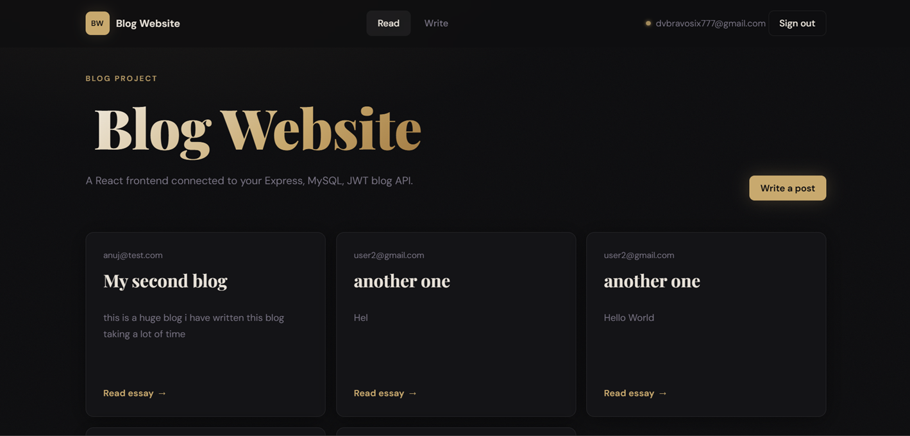
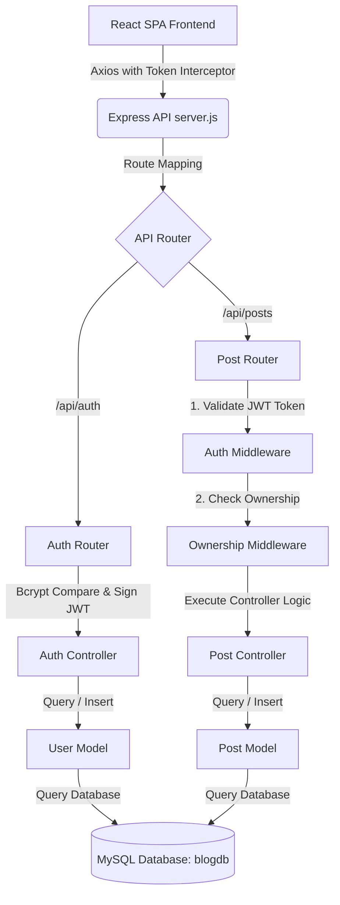

# ✒️ BW - Full-Stack Blog Platform

[](#)
[](#)
[](#)
[](#)
[](#)
[](#)

A beautiful, production-ready full-stack blog post application constructed using a **Node.js/Express MVC Backend** connected to a **MySQL Database**, serving a **React/Vite Frontend** via **Axios** with global JWT-based authorization and customized toast notifications.

---

## 🎨 Mockup Showcase



---

## 🚀 Key Features

* **Secure Authentication**: Email/password registration and login backed by **Bcrypt** password hashing.
* **Session Management**: Session persistence through **JSON Web Tokens (JWT)** with Axios interceptors.
* **Full CRUD Operations**: Users can draft, read, modify, and delete blog posts.
* **Strict Authorization**: Double-layered security. Post modification/deletion is validated on the backend via ownership middleware and authorized visually on the frontend.
* **Responsive Styling**: Crafted using modular Vanilla CSS features, dynamic variables, blur backgrounds, transitions, and hover-triggered micro-animations.

---

## 🏗️ System Architecture Flow



---

## 📂 Directory Structure

The workspace is organized into a clean split-client-server architecture:

```text
blogproject/
│
├── assets/                          # Showcase mockups and documentation graphics
│   └── mockup.png                   # High-fidelity dashboard design mockup
│
├── blog-backend/                    # Node.js/Express server (MVC)
│   ├── config/                      # Database configuration
│   │   └── db.js                    # MySQL connection setup
│   ├── controllers/                 # Business logic controllers
│   │   ├── auth.js                  # Signup & Login handler
│   │   └── post.js                  # Blog CRUD controllers
│   ├── middleware/                  # Endpoint security interceptors
│   │   ├── authmiddleware.js        # JWT verify and user injector
│   │   └── ownershipmiddleware.js   # Resource modifier permission validation
│   ├── models/                      # Database interaction layer (SQL queries)
│   │   ├── user.js                  # User queries
│   │   └── post.js                  # Post CRUD SQL statements
│   ├── routes/                      # Route mappings
│   │   ├── authroute.js             # Authentication endpoints
│   │   └── postroute.js             # Post endpoints
│   ├── .env                         # Local environment file (DB creds, JWT secret)
│   ├── .gitignore                   # Backend Git ignore configurations
│   ├── package.json                 # Backend dependencies & script configuration
│   └── server.js                    # Server entry point
│
├── blog-frontend/                   # Vite React Client SPA
│   ├── public/                      # Static assets (Favicons, SVG graphics)
│   ├── src/                         # Application source files
│   │   ├── assets/                  # Local UI graphics & icons
│   │   ├── components/              # Shared layout components
│   │   │   ├── Navbar.jsx           # Responsive dynamic header
│   │   │   ├── Footer.jsx           # Platform footer
│   │   │   └── PostCard.jsx         # Individual post view layout
│   │   ├── pages/                   # Router page views
│   │   │   ├── Home.jsx             # Landing dashboard feed
│   │   │   ├── Login.jsx            # User sign in form
│   │   │   ├── Signup.jsx           # Registration form
│   │   │   ├── CreatePost.jsx       # Blog writer workbench
│   │   │   ├── EditPost.jsx         # Post updater workspace
│   │   │   └── PostDetail.jsx       # Full post reader view
│   │   ├── api.js                   # Axios setup & request/response interceptors
│   │   ├── App.jsx                  # Main router config & route protection
│   │   ├── AuthContext.jsx          # JWT token decoder & user state manager
│   │   ├── ToastContext.jsx         # Application feedback notifications
│   │   ├── index.css                # Style system, themes, & variables
│   │   └── main.jsx                 # Client entry point
│   ├── index.html                   # HTML entry point
│   ├── vite.config.js               # Vite compilation configuration
│   └── package.json                 # Frontend dependencies & building scripts
│
└── frontend_files/                  # [Legacy/Backup Directory] Draft files
```

---

## 🗄️ Database Design

### Users Table (`users`)
Stores user accounts with hashed credentials.
* `id` (INT, Primary Key, Auto-Increment)
* `email` (VARCHAR(255), Unique)
* `password` (VARCHAR(255))

```sql
CREATE TABLE users (
    id INT PRIMARY KEY AUTO_INCREMENT,
    email VARCHAR(255) UNIQUE NOT NULL,
    password VARCHAR(255) NOT NULL
);
```

### Posts Table (`posts`)
Stores posts. Linked to the creator user by a foreign key constraint.
* `id` (INT, Primary Key, Auto-Increment)
* `title` (VARCHAR(255))
* `content` (TEXT)
* `userId` (INT, Foreign Key referencing `users.id`)

```sql
CREATE TABLE posts (
    id INT PRIMARY KEY AUTO_INCREMENT,
    title VARCHAR(255) NOT NULL,
    content TEXT NOT NULL,
    userId INT NOT NULL,
    FOREIGN KEY (userId) REFERENCES users(id) ON DELETE CASCADE
);
```

---

## 🔌 API Endpoint Reference

All backend endpoints are prefixed with `/api`.

| Endpoint | Method | Auth Required | Description | Request Body Example | Response Example (Success) |
|---|---|---|---|---|---|
| `/auth/signup` | `POST` | ❌ None | Register a new user account | `{"email": "...", "password": "..."}` | `{"message": "user created successfully"}` |
| `/auth/login` | `POST` | ❌ None | Authenticate credentials & return token | `{"email": "...", "password": "..."}` | `{"token": "eyJhbG..."}` |
| `/posts` | `GET` | ❌ None | Fetch all posts (with creator emails) | *None* | `[{"id": 1, "title": "...", "email": "..."}]` |
| `/posts/:id` | `GET` | ❌ None | Retrieve a single post by ID | *None* | `{"id": 1, "title": "...", "content": "..."}` |
| `/posts` | `POST` | ✅ JWT | Create a new blog post | `{"title": "...", "content": "..."}` | `{"message": "Post created successfully", "postId": 2}` |
| `/posts/:id` | `PATCH` | ✅ JWT + Owner | Modify an existing post | `{"title": "...", "content": "..."}` | `{"message": "Post updated successfully"}` |
| `/posts/:id` | `DELETE` | ✅ JWT + Owner | Delete a post permanently | *None* | `{"message": "Post deleted successfully"}` |
| `/profile` | `GET` | ✅ JWT | Verify and fetch current profile state | *None* | `{"message": "Protected Route", "user": {"id": 1}}` |

---

## ⚙️ Installation & Local Setup

Follow these steps to run this application locally:

### 1. Database Setup
Ensure you have MySQL server running, then execute the following SQL scripts to configure the schema:

```sql
-- Create database
CREATE DATABASE blogdb;
USE blogdb;

-- Create users table
CREATE TABLE users (
    id INT PRIMARY KEY AUTO_INCREMENT,
    email VARCHAR(255) UNIQUE NOT NULL,
    password VARCHAR(255) NOT NULL
);

-- Create posts table
CREATE TABLE posts (
    id INT PRIMARY KEY AUTO_INCREMENT,
    title VARCHAR(255) NOT NULL,
    content TEXT NOT NULL,
    userId INT NOT NULL,
    FOREIGN KEY (userId) REFERENCES users(id) ON DELETE CASCADE
);
```

### 2. Configure Backend `.env`
Create a `.env` file under `/blog-backend` with the following configuration details:

```env
DB_HOST=127.0.0.1
DB_USER=your_mysql_username
DB_PASSWORD=your_mysql_password
DB_NAME=blogdb
PORT=4000
JWT_SECRET=your_custom_secret_key_here
```

### 3. Install & Start Backend
Navigate to `/blog-backend` to install dependencies and boot up the server:

```bash
cd blog-backend
npm install
npm run dev
```
The server will start running on `http://localhost:4000`.

### 4. Install & Start Frontend
Open a new terminal window, navigate to `/blog-frontend` to set up dependencies and launch the client dev server:

```bash
cd blog-frontend
npm install
npm run dev
```
The client dashboard will compile and launch on `http://localhost:5173`. Open this URL in your browser to view the application.

---

## 🧹 Folder & File Structure Review Remarks

After a comprehensive review of the project files, the following directory details are noted:
* **Duplicate README files**: Duplicated readmes inside `blog-frontend/` and `frontend_files/` have been removed to preserve a single source of documentation truth.
* **Gitignore Policies**: Added `.gitignore` configurations at the workspace root and in the backend folder to prevent uploading node_modules and secrets (`.env`).
* **Legacy Files**: The folder `frontend_files/` acts as a legacy drafts folder containing backup file versions. A copy of a resume PDF (`frontend_files/resume__Copy_.pdf`) is stored here. For security and neatness when publishing on GitHub, it is recommended to delete this folder or move personal documents outside of the active project repository workspace.
