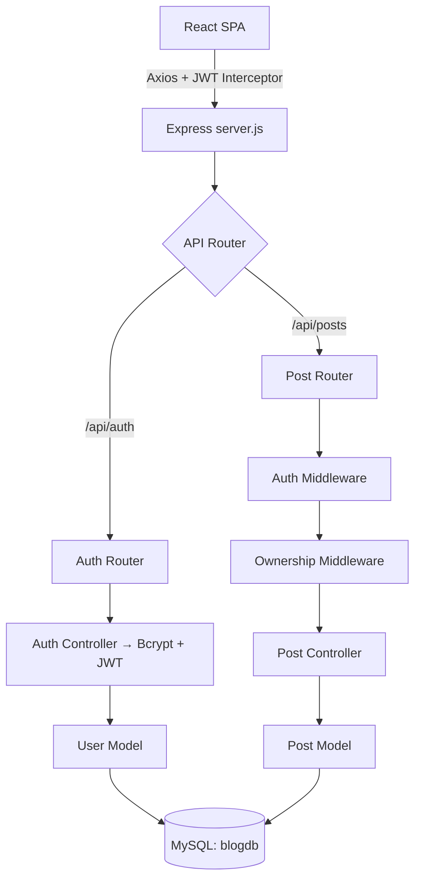

# ✒️ BW — Full-Stack Blog Platform

[](#)
[](#)
[](#)
[](#)
[](#)
[](#)

A production-ready full-stack blog platform built with a **Node.js/Express MVC backend**, **MySQL database**, and a **React/Vite SPA frontend** — connected via Axios with JWT authentication and toast notifications.


---

## Features

- **Authentication** — Email/password registration and login with Bcrypt password hashing
- **Session Management** — JWT-based persistence with Axios request interceptors
- **Full CRUD** — Create, read, update, and delete blog posts
- **Authorization** — Ownership validated on both the backend (middleware) and frontend (conditional UI)
- **Responsive UI** — Modular Vanilla CSS with variables, blur effects, transitions, and micro-animations

---

## Tech Stack

| Layer | Technology | Purpose |
|-------|-----------|---------|
| Frontend | React 19 + Vite 8 | Component-based SPA with fast HMR dev server and optimized production builds |
| Routing | React Router v6 | Client-side routing with protected route wrappers |
| HTTP Client | Axios | Promise-based requests with request/response interceptor support |
| Backend | Node.js + Express 5 | RESTful API server following MVC separation |
| Database | MySQL 8 | Relational data storage with foreign key constraints |
| Auth | JSON Web Tokens | Stateless session tokens signed with a server secret |
| Password Security | Bcrypt | Salted hashing — raw passwords are never stored |
| Styling | Vanilla CSS (Modular) | Custom design system using CSS variables, no framework dependency |

---

## Architecture



---

## Security Implementation

### Authentication Flow

1. **Signup** — The user submits an email and password. The backend hashes the password with Bcrypt (salted) and inserts the record into the `users` table. The raw password is never persisted.
2. **Login** — The submitted password is compared against the stored hash using `bcrypt.compare()`. On success, the server signs a JWT containing the user's `id` and returns it to the client.
3. **Token Storage** — The frontend stores the JWT and attaches it to every subsequent request via an Axios request interceptor in `api.js`, injecting it as a `Bearer` token in the `Authorization` header.
4. **Token Decoding** — `AuthContext.jsx` decodes the JWT payload on the client side to expose the current user's `id` to the rest of the React app without an extra network call.

### Middleware Chain (Protected Routes)

Mutating post endpoints (`POST /posts`, `PATCH /posts/:id`, `DELETE /posts/:id`) pass through two middleware layers before reaching the controller:

```
Request → Auth Middleware → Ownership Middleware → Post Controller
```

- **`authmiddleware.js`** — Verifies the JWT signature using the server secret. If valid, injects the decoded user object (`req.user`) into the request. Rejects with `401` if the token is missing or tampered.
- **`ownershipmiddleware.js`** — Fetches the target post and compares its `userId` against `req.user.id`. Rejects with `403` if they don't match, preventing users from modifying each other's posts.

This double-layer means authorization is enforced server-side regardless of what the frontend renders.

---

## Frontend UX

### Routing & Route Protection

`App.jsx` defines all client-side routes using React Router v6. Protected pages (Create Post, Edit Post) are wrapped in a route guard component that reads the auth state from `AuthContext`. Unauthenticated users are redirected to `/login` automatically.

```
/            → Home (public feed)
/login       → Login form
/signup      → Registration form
/posts/:id   → Post detail view
/create      → Create post (protected)
/edit/:id    → Edit post (protected, owner only)
```

### Auth Context (`AuthContext.jsx`)

A React context that decodes the stored JWT on mount and exposes `{ user, login, logout }` globally. Components consume this context to conditionally render UI — for example, showing Edit/Delete controls only when `user.id` matches the post's `userId`.

### Toast Notifications (`ToastContext.jsx`)

A lightweight global notification system built with React context. Any component can trigger a toast by calling `useToast()` — no prop drilling required. Used for feedback on actions like post creation, update, deletion, login errors, and auth failures.

### CSS Design System (`index.css`)

The entire visual layer is built with Vanilla CSS using:
- **CSS custom properties** for consistent theming (colors, spacing, border radii)
- **Blur backgrounds** (`backdrop-filter`) for layered glass-style surfaces
- **Transitions** on interactive elements for smooth state changes
- **Hover micro-animations** on cards and buttons for tactile feedback

---

## Project Structure

```
blogproject/
├── assets/                        # Documentation graphics
├── blog-backend/                  # Node.js/Express server (MVC)
│   ├── config/db.js               # MySQL connection
│   ├── controllers/
│   │   ├── auth.js                # Signup & login logic
│   │   └── post.js                # CRUD logic
│   ├── middleware/
│   │   ├── authmiddleware.js      # JWT verification
│   │   └── ownershipmiddleware.js # Resource ownership check
│   ├── models/
│   │   ├── user.js                # User SQL queries
│   │   └── post.js                # Post SQL queries
│   ├── routes/
│   │   ├── authroute.js           # Auth endpoints
│   │   └── postroute.js          # Post endpoints
│   ├── .env                       # Environment config (not committed)
│   ├── package.json
│   └── server.js                  # Entry point
│
└── blog-frontend/                 # Vite + React SPA
    ├── public/
    └── src/
        ├── components/
        │   ├── Navbar.jsx
        │   ├── Footer.jsx
        │   └── PostCard.jsx
        ├── pages/
        │   ├── Home.jsx
        │   ├── Login.jsx
        │   ├── Signup.jsx
        │   ├── CreatePost.jsx
        │   ├── EditPost.jsx
        │   └── PostDetail.jsx
        ├── api.js                 # Axios instance + interceptors
        ├── App.jsx                # Router + route protection
        ├── AuthContext.jsx        # JWT decoder + user state
        ├── ToastContext.jsx       # Global notifications
        ├── index.css              # Design system + CSS variables
        └── main.jsx               # Entry point
```

---

## Database Schema

```sql
CREATE DATABASE blogdb;
USE blogdb;

CREATE TABLE users (
    id       INT PRIMARY KEY AUTO_INCREMENT,
    email    VARCHAR(255) UNIQUE NOT NULL,
    password VARCHAR(255) NOT NULL
);

CREATE TABLE posts (
    id      INT PRIMARY KEY AUTO_INCREMENT,
    title   VARCHAR(255) NOT NULL,
    content TEXT NOT NULL,
    userId  INT NOT NULL,
    FOREIGN KEY (userId) REFERENCES users(id) ON DELETE CASCADE
);
```

---

## API Reference

All endpoints are prefixed with `/api`.

| Method | Endpoint | Auth | Description |
|--------|----------|------|-------------|
| `POST` | `/auth/signup` | — | Register a new user |
| `POST` | `/auth/login` | — | Login and receive a JWT |
| `GET` | `/posts` | — | Fetch all posts |
| `GET` | `/posts/:id` | — | Fetch a single post |
| `POST` | `/posts` | JWT | Create a new post |
| `PATCH` | `/posts/:id` | JWT + Owner | Edit an existing post |
| `DELETE` | `/posts/:id` | JWT + Owner | Delete a post |
| `GET` | `/profile` | JWT | Verify session and fetch current user |

---

## Local Setup

### 1. Database

Run the SQL schema above on a local MySQL instance.

### 2. Backend Environment

Create `/blog-backend/.env`:

```env
DB_HOST=127.0.0.1
DB_USER=your_mysql_username
DB_PASSWORD=your_mysql_password
DB_NAME=blogdb
PORT=4000
JWT_SECRET=your_secret_key
```

### 3. Start the Backend

```bash
cd blog-backend
npm install
npm run dev
# Runs on http://localhost:4000
```

### 4. Start the Frontend

```bash
cd blog-frontend
npm install
npm run dev
# Runs on http://localhost:5173
```

---

## Notes

- The `frontend_files/` folder is a legacy drafts directory and is safe to delete before publishing.
- Ensure `.env` and `node_modules` are covered by `.gitignore` before pushing to a public repository.
